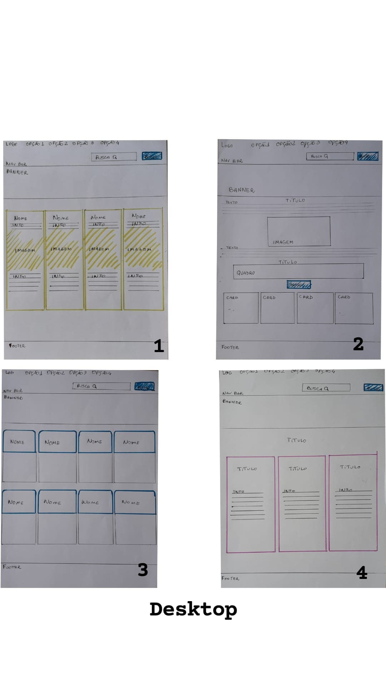
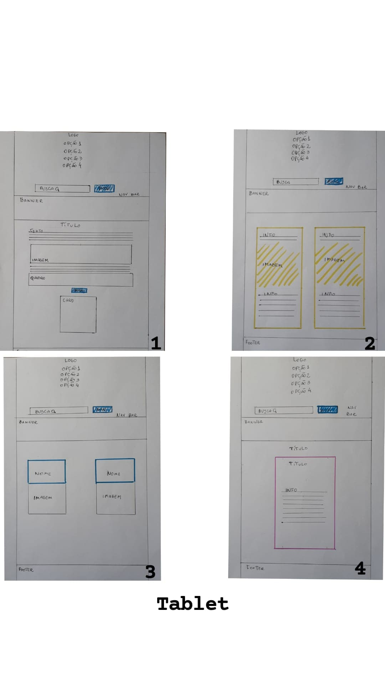
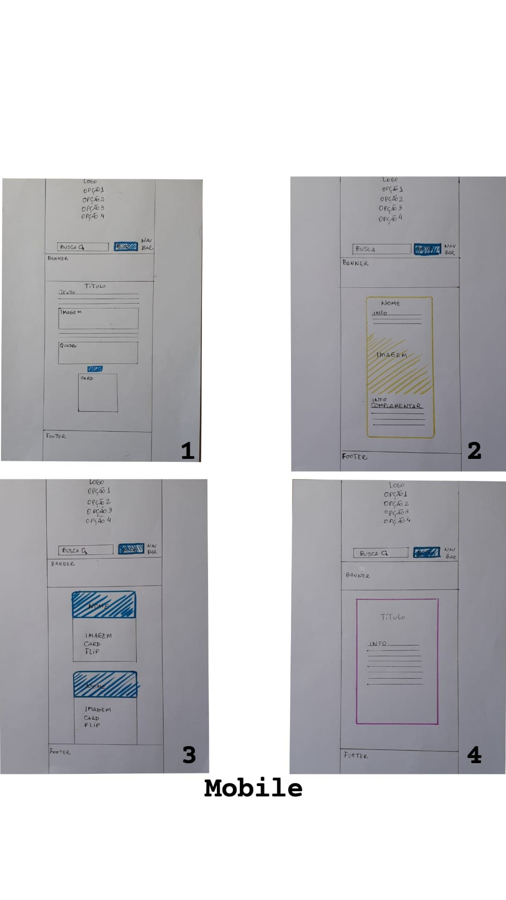

# Olimpíadas Data Lovers

## Índice

* [1. Introdução](#1-Introdução)
* [2. Definição de Produto](#2-Definição-de-Produto)
* [3. Definição do Usuário](#3-Definição-do-Usuário)
* [4. Histórias de Usuario](#4-Histórias-de-Usuário)
* [5. Protótipo de Baixa Fidelidade](#5-Protótipo-de-Baixa-Fidelidade)
* [6. Teste de Usabilidade](#6-Teste-de-Usabilidade)
* [7. Demonstração da Aplicação](#7-Funcionalidades-da-Aplicação)
* [8. Considerações Tecnicas e Execução](#8-Considerações-Tecnicas-e-Execução)
* [9. Autores](#9-Autores)

***

<p align="center"> 
</p>

<h4 align="center"> Olimpíadas Data Lovers :fireworks: Concluído :fireworks:
</h4>
 
## 1. Introdução :black_nib:
Os Jogos Olímpicos são a única competição de atletismo verdadeiramente global, multiesportiva e comemorativa. Com mais de 200 países participando em mais de 400 eventos nos Jogos de Verão e Inverno, as Olimpíadas são onde o mundo vem para competir, se sentir inspirado e estar junto.

Originalmente, os Jogos Olímpicos da Antiguidade foram realizados em Olímpia, na Grécia, do século VIII a.C. ao século V d.C.. 

Os Jogos têm crescido em escala, a ponto de quase todas as nações serem representadas. A cada dois anos, os Jogos Olímpicos e sua exposição à mídia proporcionam a atletas desconhecidos a chance de alcançar fama nacional e, em casos especiais, a fama internacional. Os Jogos também constituem uma oportunidade importante para a cidade e o país se promover e mostrar-se para o mundo.

Nosso projeto, **OLIMPÍADAS DATA LOVERS**,  foi desenvolvido a partir do banco de dados dos Jogos Olímpicos do Rio de Janeiro e se trata de uma aplicação web que ajuda os amantes dos Jogos Olímpicos a terem mais informações sobre os atletas participantes, os esportes e modalidades praticados e ainda conhecer os países que participam dessa competição.


## 2. Definição de Produto: :pencil: 
O processo de desenvolvimento da aplicação começou com bastante pesquisa, pois não queriamos reproduzir o site dos Jogos Olímpicos do Rio de Janeiro, pois em conversas com alguns usuários, estes não gostavam da experiencia visual do site.

Buscamos então, inspiração no site dos Jogos Olímpicos de Tokyo, utilizamos a paleta de cores original das Olímpiadas e demos um toque especial, com muitas cores, imagens e a alegria que remete ao povo Brasileiro.

Criamos um site que permite ao nosso usuário pesquisar seus atletas favoritos, saber suas principais características, suas vitórias e ainda conhecer um pouquinho da história dos Jogos Olímpicos e a importância das mulheres no evento. Nossos usuários também conseguem pesquisar os países que participam do evento e visualizar quem são os atletas de cada país.

## 3. Definição do Usuário: :woman: :family: :alien: :man:
Para elucidar quem seriam os usuarios em potencial, escolhemos criar personas para melhorar o entendimentos das necessidades de cada um. Veja o exemplo abaixo.
**Persona Um**
<p align="center"> 
</p>

 **Persona Dois**
<p align="center"> 
</p>

## 4. Histórias de Usuário: :book:

**Primeira História de Usuário**
> Como usuário, quero que informações relevantes sobre atletas olímpicos como: nome, altura, peso, país que representa, especialidade esportivas,disciplinas que venceu e seu respectivo número de medalhas apareçam na tela. E também é importante buscar o atleta pelo seu nome, para visulizar apenas suas informações.

**Segunda História de Usuário**
>Como usuário, quero poder acessar quais são os países participantes das Olimpíadas, e poder visuzalizar quais são os atletas participantes por país. Também é importante conseguir ordenar os paises alfabeticamente, de a-z ou de z-a.

**Terceira História de Usuário**
>Como usuário, quero poder acessar os esportes disputados nas Olimpíadas, e visualizar quais são as suas disciplinas.Também é importante conseguir ordenar os esportes alfabeticamente, de a-z ou de z-a.

**Quarta História de Usuário**
>Como usuário, quero saber o o número de mulheres atletas que participaram e ganharam medalhas. Também é importante poder acessar curiosidades e informações basicas a respeito das Olimpíadas do Rio 2016.
 

**Wireframe - Desktop**
<p align="center"> 
</p>

**Wireframe - Tablet**
<p align="center"> 
</p>

**Wireframe - Mobile**
<p align="center"> 
</p>

## 6. Teste de Usabilidade: :mag_right: :100:

A cada entrega de funcionalidade fizemos testes de usabilidade com alguns usuários. A partir desses testes verificamos a necessidade de fazer alteraçòes nos cards que contiam as informações dos atletas, isso porque os usuários que testaram a aplicação tinham dificuldades de saber a quantidade de medalhas que cada atleta possuia e quais eram os esportes e eventos que estes participavam.

Outro ponto sugerido para modificação pelos usuários, foi a organização das informações dos atletas de forma mais clara, pois estava tudo muito junto e sem muitas divisões, o que causava a impressão de uma aplicação mal planejada. Assim implementamos o flip cards que na frente contém o nome do atleta e no verso suas informações separdas por itens, o que permite ao usuário ter maior clareza e facilidade de localizar a informação desejada.

Melhoramos também o design da aplicação, padronizando os tamanhos de todos os cards, proporcionando assim uma experência visual mais agradável para os usuários.

## 7. Demonstração da Aplicação: :computer: :iphone:
Por meio de gifs vamos demonstrar a usabilidade do nosso produto em formato Desktop, Tablet e Mobile.

**Desktop**
<p align="center"> >
</p>

**Tablet**
<p align="center"> >
</p>

**Mobile**
<p align="center"> 
</p

## 8. Considerações Tecnicas e Execução: :exclamation: :grey_exclamation:
A estruturação do conteudo foi feita utilizando o _HTML_, como boa pratica fizemos o uso do HTML Semântico, pensando na acessibiliade do produto.

A estilização foi feita com o _CSS_, pudemos criar efeitos visuais, pensando em como deixar o produto mais agradavel, dinamico e personalizado, tendo como foco a responsividade. 

Para permitir o dinamismo e interatividade entre o usuário e o produto utilizamos o _JavaScript_, sendo a logica do projeto implementada inteiramente nessa linguagem. 

Verificamos a funcionalidade de nosso site atraves do _Jest_, framework de de testes em _JavaScript_, e o _ESlint_ aplicado para padronizar o código. 

**Instalando e Executando** :tada:

Para executar o projeto é preciso ter instalado no seu computador:
-Um editor de codigo, por exemplo o [VSCode] (https://code.visualstudio.com/)
[Git](https://git-scm.com/downloads) [Node/NPM] (https://nodejs.org/en/download/)

-Abra um terminal (pode ser no seu editor de codigo);
-Para instalar esse projeto, basta clona-lo no seu terminal:
```sh
git clone https://github.com/lanizia/SAP006-data-lovers
```

-Então instale as dependêcias do projeto dessa maneira:
```sh
npm install
```
-Executando o projeto no seu computador: 
```sh
npm start
```
-Para visualizar o projeto, basta copiar o link que vai aparecer e colar no seu navegador. 
```sh
http://localhost:5000
```
-Você pode executar os testes também:
```sh
npm test
```

Você também pode acessar o nosso projeto clicando [aqui](https://lanizia.github.io/SAP006-data-lovers/)

## 9. Autores: :trophy: :love_letter:
O projeto é a segunda aplicação desenvolvida no bootcamp da Laboratória, pelas estudantes de fron-end [Monique Ténorio](https://github.com/tenorionique) e [Lana Souza](https://github.com/lanizia). Foi um desafio incrível que proporcionou muito aprendizado, ótimo trabalho em equipe e ainda boas risadas! 

